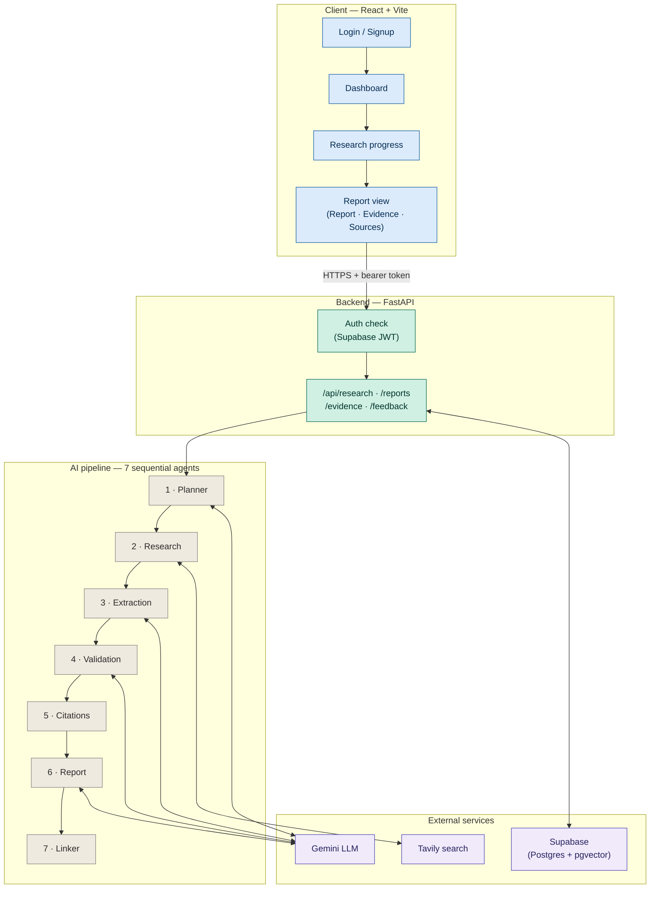
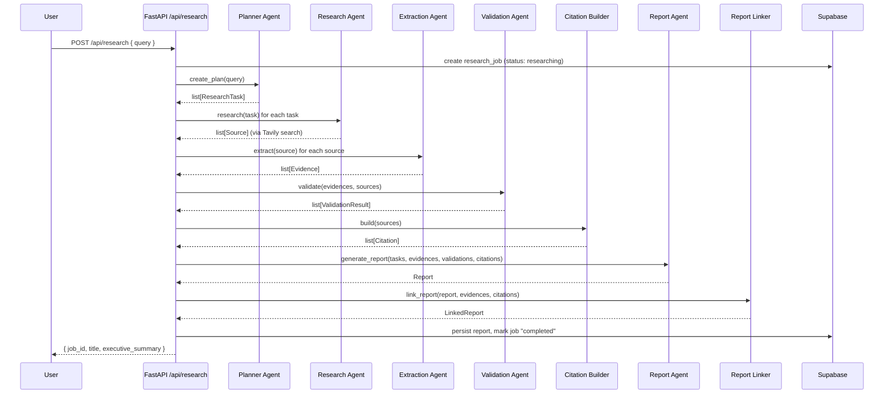
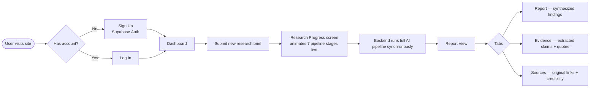

# 🧭 McKinsey AI Market Research & Strategy Engine

> A full-stack, multi-agent AI system that takes a single research brief and autonomously plans, researches, extracts, validates, and writes a fully cited, consulting-grade market research report.

<p align="center">
  
  
  
  
  
  
</p>

---

## 1. What This Project Is

This project is an **AI-powered market research analyst**. A signed-in user submits a research brief (e.g. *"Analyze the competitive landscape of the EV battery market in Southeast Asia"*), and behind the scenes a pipeline of six specialized AI agents works in sequence to:

1. Break the brief into a structured research plan,
2. Search the live web for relevant sources,
3. Extract concrete, quotable evidence from each source,
4. Cross-check that evidence for reliability,
5. Turn validated evidence into a polished report, and
6. Attach every claim in the report back to its original citation.

The result is served to the user through a McKinsey-styled web dashboard where they can watch the pipeline run in real time and then read the final report with a **Report / Evidence / Sources** tabbed view — every key finding traceable back to a live web source.

---

## 2. System Architecture

The project is split into two independently deployed halves that communicate over a REST API secured with Supabase Auth.



**Frontend** — a React 19 single-page app (built with Vite) responsible for authentication, brief submission, an animated progress screen, and a tabbed report viewer.

**Backend** — a FastAPI service responsible for authentication enforcement, orchestrating the AI pipeline synchronously per request, and persisting every intermediate artifact (tasks, sources, evidence, validations, reports) to Postgres so the frontend can query any stage of a job after the fact.

**Database** — Supabase (managed Postgres), used both for structured relational data and, via the `pgvector` extension, for a `memory_records` table capable of storing embeddings for future semantic recall.

---

## 3. The Multi-Agent Research Pipeline

The heart of the project is `ai/pipeline/research_pipeline.py`, which orchestrates seven sequential stages. Each stage has a single, focused responsibility and hands a typed data structure to the next.



| Stage | Module | Responsibility |
|---|---|---|
| **1. Planning** | `ai/planner/planner_agent.py` | Decomposes the user's raw research brief into a list of discrete, searchable `ResearchTask`s. |
| **2. Research** | `ai/research/research_agent.py` | Executes a live web search per task (via **Tavily**) and returns a list of candidate `Source`s. |
| **3. Extraction** | `ai/extraction/extraction_agent.py` | Reads each source and pulls out concrete, quotable `Evidence` (claim + supporting quote). |
| **4. Validation** | `ai/validation/validation_agent.py` | Cross-checks each piece of evidence against its source and assigns a confidence / reliability verdict. |
| **5. Citation Building** | `ai/report/citation_builder.py` | Converts raw sources into properly formatted citation objects. |
| **6. Report Generation** | `ai/report/report_agent.py` | Synthesizes all validated evidence into a structured `Report` (title, executive summary, key findings). |
| **7. Report Linking** | `ai/report/report_linker.py` | Rewrites the report so every key finding is hyperlinked back to its supporting evidence and citation — this is what powers the "Evidence" and "Sources" tabs in the UI. |

The pipeline is intentionally **fail-fast**: if any stage returns an empty result (no tasks, no sources, no evidence, etc.), the pipeline raises immediately rather than silently producing a hollow report, and the job is marked `failed` in the database.

**LLM & Search Providers**
- **Gemini** (`google-genai`) is the reasoning engine used by the Planner, Extraction, Validation, and Report agents (`ai/llm/gemini.py`).
- **Tavily** is the live web search provider used by the Research agent (`ai/browser/tavily_search.py`), with a `mock_search.py` fallback available for offline development/testing.

---

## 4. Backend — FastAPI Service

**Location:** `Backend McKinsey/mckinsey-research-engine/`

### 4.1 Layout

```
backend/
├── main.py                  # FastAPI app factory, middleware, routers
├── core/
│   ├── config.py             # Pydantic settings loaded from .env
│   ├── auth.py                # Supabase JWT verification dependency
│   ├── errors.py              # Centralized AppError → HTTP response mapping
│   └── logging.py             # Structured logging configuration
├── middleware/
│   └── request_id.py          # Attaches a unique request ID to every request
├── api/
│   ├── research.py             # Create + inspect research jobs (the core workflow)
│   ├── reports.py              # Fetch generated reports
│   ├── evidence.py              # Fetch raw evidence records
│   └── feedback.py               # Reviewer feedback on reports
├── repositories/                # One repository per table — all Supabase reads/writes
├── services/
│   └── research_service.py       # Bridges the API layer to the AI pipeline
└── db/
    ├── supabase_client.py         # Supabase client singleton
    └── migrations/                  # Ordered SQL migrations (001 → 009)
```

### 4.2 Authentication & Authorization

Every protected route depends on `get_current_user` (`backend/core/auth.py`):

1. The frontend sends the Supabase session's **access token** as a `Bearer` token in the `Authorization` header.
2. The backend calls `supabase.auth.get_user(token)` to verify the token **server-side** against Supabase.
3. If valid, the authenticated `user` object is injected into the route; if not, a `401` is raised.
4. On job-scoped routes (`/api/research/{job_id}/...`), an additional `_ensure_owner` check confirms the requesting user actually created that job before returning any data — returning `403` otherwise.

This means **no research job or report is ever visible to a user who didn't create it**, even if they know the job's UUID.

### 4.3 API Surface

| Method | Route | Purpose |
|---|---|---|
| `GET` | `/` | Service metadata / liveness |
| `GET` | `/health` | Health check (used by uptime monitors / deploy platforms) |
| `GET` | `/api/research/` | List all research jobs owned by the current user |
| `POST` | `/api/research/` | Submit a new brief → runs the full AI pipeline synchronously → returns the completed job |
| `GET` | `/api/research/{job_id}` | Fetch job status/metadata |
| `GET` | `/api/research/{job_id}/tasks` | Planner-generated research tasks for a job |
| `GET` | `/api/research/{job_id}/sources` | Sources discovered during research |
| `GET` | `/api/research/{job_id}/evidence` | Extracted evidence items |
| `GET` | `/api/research/{job_id}/validations` | Validation verdicts per evidence item |
| `GET` | `/api/research/{job_id}/report` | The final generated report |

### 4.4 Database Schema (Supabase / Postgres)

Nine ordered migrations build the schema incrementally:

| # | Migration | Table(s) created |
|---|---|---|
| 001 | Initial schema / Research Jobs | `research_jobs` |
| 002 | Planner Tasks | `planner_tasks` |
| 003 | Sources | `sources` |
| 004 | Evidence | `evidence` |
| 005 | Validation Records | `validation_records` |
| 006 | Memory | `memory_records` (with `pgvector` embedding column for future semantic search) |
| 007 | Reports | `reports` |
| 008 | Feedback | `feedback` |
| 009 | Indexes | Performance indexes on `evidence.job_id`, `planner_tasks.job_id`, and an `ivfflat` vector index on `memory_records.embedding` |

`research_jobs.created_by` and `feedback.reviewer_id` both reference `auth.users(id)`, tying every record directly to a Supabase Auth identity — this is what makes per-user data isolation possible.

### 4.5 Backend Environment Variables

```env
# Search / AI provider keys used by the research pipeline
GOOGLE_API_KEY=          # Gemini API key
TAVILY_API_KEY=          # Tavily web search API key

# Supabase project (Project Settings > API in the Supabase dashboard)
SUPABASE_URL=https://your-project-ref.supabase.co
SUPABASE_KEY=            # SERVICE ROLE key — backend only, never expose to the frontend
```

---

## 5. Frontend — React + Vite Dashboard

**Location:** `Frontend McKinsey/vite-project/`

### 5.1 Layout

```
src/
├── App.jsx                     # Route definitions
├── main.jsx                     # React entry point
├── context/
│   ├── AuthContext.jsx           # Supabase session state, login/signup/logout
│   └── ThemeContext.jsx           # Light/dark theme toggle
├── components/
│   ├── ProtectedRoute.jsx          # Redirects unauthenticated users to /login
│   ├── AuthLayout.jsx               # Shared shell for Login/Signup
│   ├── Shell.jsx                     # Main app shell (nav, layout) for authenticated pages
│   ├── StatusBadge.jsx                # Visual pipeline-status indicator
│   └── Footer.jsx
├── pages/
│   ├── Login.jsx / Signup.jsx           # Supabase Auth screens
│   ├── Dashboard.jsx                      # List of past research jobs + "new research" entry point
│   ├── ResearchProgress.jsx                 # Animated live view of the 7-stage pipeline running
│   ├── ReportView.jsx                        # Tabbed final output: Report / Evidence / Sources
│   ├── Methodology.jsx                        # Explains how the AI pipeline works, for end users
│   └── AboutProject.jsx                        # Project background page
├── api/
│   └── client.js                # Central fetch wrapper — attaches the Supabase bearer token to every request
└── lib/
    └── supabaseClient.js         # Supabase JS client singleton (anon key)
```

### 5.2 Routing Map

| Route | Page | Access |
|---|---|---|
| `/login` | `Login` | Public |
| `/signup` | `Signup` | Public |
| `/` | `Dashboard` | Protected |
| `/research/new` | `ResearchProgress` | Protected |
| `/research/:jobId` | `ReportView` | Protected |
| `/methodology` | `Methodology` | Protected |
| `/about` | `AboutProject` | Protected |
| `*` | → redirects to `/` | — |

`ProtectedRoute` wraps every authenticated page and reads session state from `AuthContext`; unauthenticated visitors are always redirected to `/login`.

### 5.3 Design System

The UI follows a **navy-and-gold "Meridian" consulting brand** intended to evoke a McKinsey-style strategy deliverable: dark navy chrome, gold accent highlights, and clean, data-forward typography. Styling is implemented with **Tailwind CSS v4**, animations with **Framer Motion** (used heavily on the live `ResearchProgress` screen), and iconography from **Lucide React**, **React Icons**, and **FontAwesome**.

### 5.4 Frontend Environment Variables

```env
# Supabase project settings (Project Settings > API in the Supabase dashboard)
VITE_SUPABASE_URL=https://your-project-ref.supabase.co
VITE_SUPABASE_ANON_KEY=paste-your-anon-public-key-here   # public/anon key only

# Base URL of the FastAPI backend
VITE_API_BASE_URL=http://localhost:8000
```

> ⚠️ The frontend must **only** ever use the Supabase **anon/public** key. The **service role** key belongs exclusively in the backend `.env` and must never ship to the browser.

---

## 6. End-to-End User Flow



1. A new user **signs up** or an existing user **logs in** through Supabase Auth on the frontend.
2. Once authenticated, the user lands on the **Dashboard**, which lists any research jobs they've previously run.
3. Submitting a new brief navigates to `/research/new`, where the **Research Progress** screen calls `POST /api/research/` and shows an animated representation of the pipeline while the backend works.
4. The backend runs the entire seven-stage pipeline **synchronously** within that single request, persisting every intermediate artifact to Supabase along the way, and returns the completed job.
5. The user is taken to `/research/:jobId` — the **Report View** — where they can move between the **Report**, **Evidence**, and **Sources** tabs to inspect the output at any level of depth, from the final narrative all the way down to the original web source behind any individual claim.

---

## 7. Tech Stack Summary

| Layer | Technology |
|---|---|
| Frontend framework | React 19 + Vite |
| Frontend styling | Tailwind CSS v4, Framer Motion |
| Frontend auth | Supabase JS client (`@supabase/supabase-js`) |
| Routing | React Router v7 |
| Backend framework | FastAPI (Python) |
| Backend server | Uvicorn |
| Config management | Pydantic Settings |
| Database | Supabase (Postgres) + `pgvector` extension |
| Backend auth | Supabase Auth (server-side JWT verification) |
| LLM provider | Google Gemini (`google-genai`) |
| Web search provider | Tavily |
| Deployment target (frontend) | Vercel (`vercel.json` present) |

---

## 8. Getting the Project Running Locally

These are the steps required to take this exact codebase from a fresh clone to a fully working local instance.

### Step 1 — Prerequisites
Install **Git**, **Node.js** (v18+), and **Python** (3.11+).

### Step 2 — Set Up Supabase
1. Create a new project at [supabase.com](https://supabase.com).
2. In the SQL editor, run each file in `backend/db/migrations/` **in numeric order** (`001` → `009`) to build the full schema, including the `pgvector` extension and indexes.
3. From **Project Settings → API**, copy:
   - The **Project URL**
   - The **anon/public key** (for the frontend)
   - The **service_role key** (for the backend only)

### Step 3 — Backend Setup
```bash
cd "Backend McKinsey/mckinsey-research-engine"
python -m venv venv
source venv/bin/activate        # Windows: venv\Scripts\activate
pip install -r backend/requirements.txt

cp .env.example .env
# then fill in: GOOGLE_API_KEY, TAVILY_API_KEY, SUPABASE_URL, SUPABASE_KEY (service role)

uvicorn backend.main:app --reload --port 8000
```
The API will be live at `http://localhost:8000`, with interactive docs at `http://localhost:8000/docs`.

### Step 4 — Frontend Setup
```bash
cd "Frontend McKinsey/vite-project"
npm install

cp .env.example .env
# then fill in: VITE_SUPABASE_URL, VITE_SUPABASE_ANON_KEY, VITE_API_BASE_URL=http://localhost:8000

npm run dev
```
The app will be live at `http://localhost:5173`.

### Step 5 — Verify
1. Open the frontend, sign up for a new account.
2. Submit a test research brief and confirm the progress screen animates through the pipeline stages.
3. Confirm the completed job produces a report with populated **Report**, **Evidence**, and **Sources** tabs.

### Step 6 — Deploy (Production)
- **Frontend:** deploy via Vercel using the included `vercel.json`; set the three `VITE_*` environment variables in the Vercel project settings, pointing `VITE_API_BASE_URL` at the deployed backend URL.
- **Backend:** deploy the FastAPI app to your platform of choice (e.g. Render, Railway, Fly.io); set `SUPABASE_URL`, `SUPABASE_KEY` (service role), `GOOGLE_API_KEY`, `TAVILY_API_KEY`, and `CORS_ORIGINS` (comma-separated list including the deployed frontend domain).

---

## 9. Security Notes

- **Two-tier Supabase keys**: the anon/public key (safe for the browser) is used by the frontend for auth flows only; the service-role key (full database access) is confined to the backend and is never exposed client-side.
- **Server-verified sessions**: the backend does not trust any client-supplied identity — every request's bearer token is independently verified against Supabase on every call.
- **Per-user data isolation**: job ownership is enforced at the API layer (`_ensure_owner`), so users can only ever read their own research jobs, tasks, sources, evidence, validations, and reports.
- **CORS** is explicitly restricted via the `CORS_ORIGINS` setting rather than left open, so only approved frontend origins may call the API.

---

## 10. Project Status

This repository represents the **final, deployed state** of the McKinsey AI Market Research & Strategy Engine — a working, end-to-end multi-agent research application spanning authentication, a seven-stage AI pipeline, full evidence traceability, and a polished consulting-styled UI.
